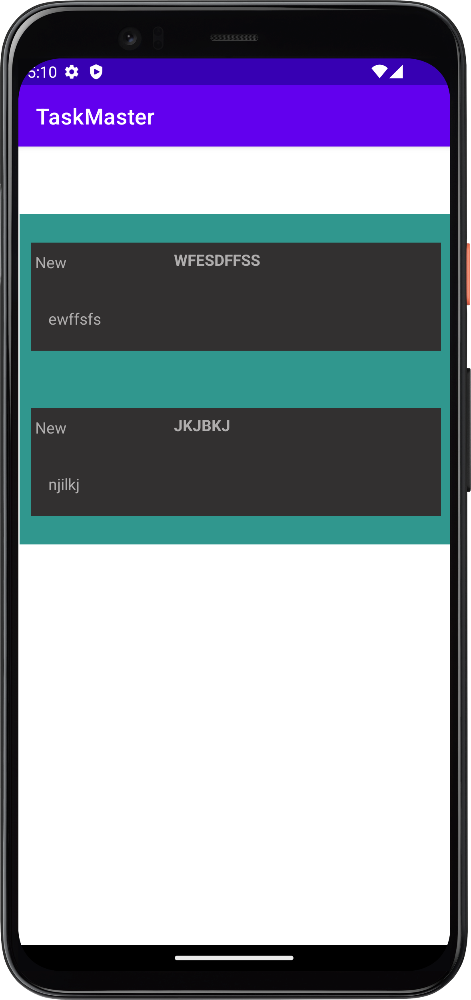

# TaskMaster
### A way to track your tasks

Changelog

12/1 -> 
  -Adds three initial pages and links them together

12/3 ->   
  - Adds a user settings page where the user can input their username and it will be displayed on the main page
  - Adds All task page where the user can click on a task on the main page and it will navigate to all tasks with information about the specific task

12/4 ->
  - Allows the user to view all of their hard coded tasks by navigating from their main page and clicking the All Tasks button
  - Each fragment displays the state, title, and description of the task

12/5 ->
  - connected Room db to application, you can now input a task and it will be saved to the db and display in all tasks
  - Added additional styling
  
  12/8 ->
    -Switched databases from Room to Graph QL
    -Implemented AWS amplify

12/12 ->
  -Added a new model: Team
  -It can be assigned to each task upon creation
  
12/13 ->
  -Added login functionality
  -Added signup functionality 
  -Added logout functionality

12/14 ->
    -Added the ability to assign images to a task
    -Implemented S3 bucket functionality 
    -Image displays on Task Details page

